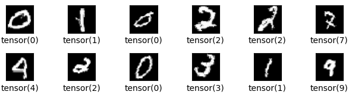

# Digit Recognizer

  

## About

Code for the Kaggle competition ['Digit Recognizer'](https://www.kaggle.com/competitions/digit-recognizer/overview), with Pytorch + CNN.

## Score

**0.99328**

## Usage

1. Download dataset from the competition page
2. Modify the `base_path` in the code and run it
3. Submit `submission.csv`

## Contributing

Your contribution is always welcome. Please read [Contributing Guide](.github/CONTRIBUTING.md).

## References

https://www.kaggle.com/code/cgurkan/mnist-with-pytorch-cnn
